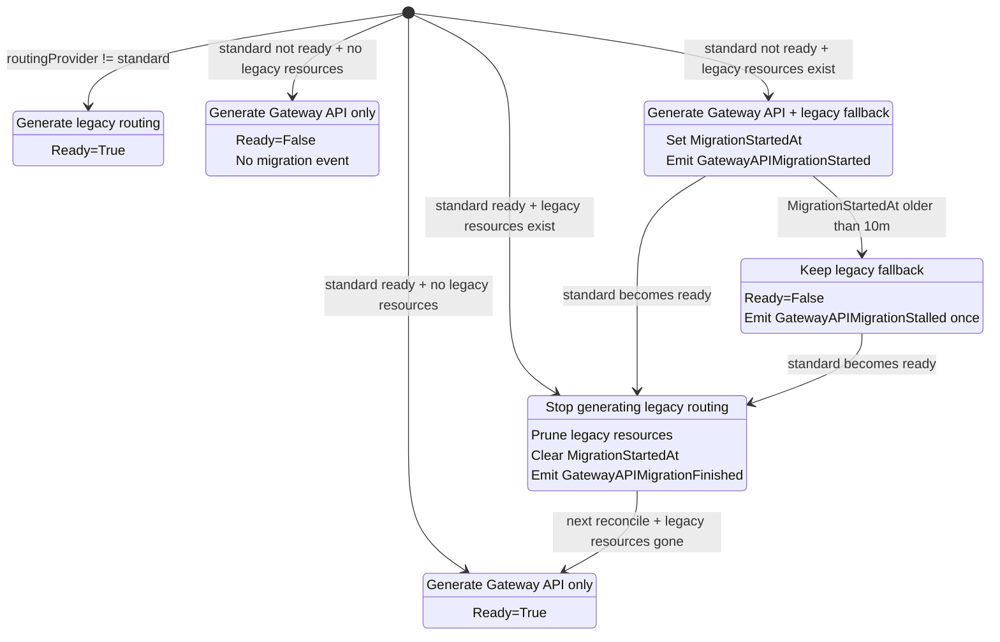

# Gateway API migration flow

`gwapi` owns the routing migration state machine. Reconcilers call
`EvaluateRoutingState` before resource generation, then `UpdateRoutingStatus`
after generated resources have been processed.

Legend:

- `standard ready` means ListenerSets, HTTPRoutes, Certificates, and TLS Secrets
  are accepted, programmed, and ready.
- `legacy resources exist` means previous Istio Gateway or VirtualService
  resources are still present.
- Greenfield standard routing never creates legacy fallback.
