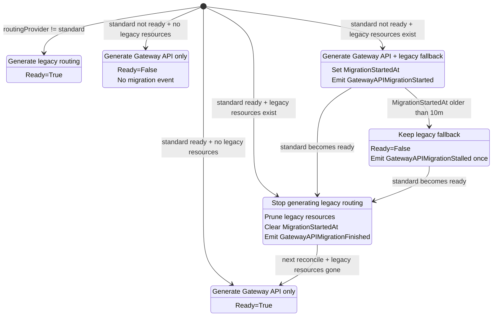
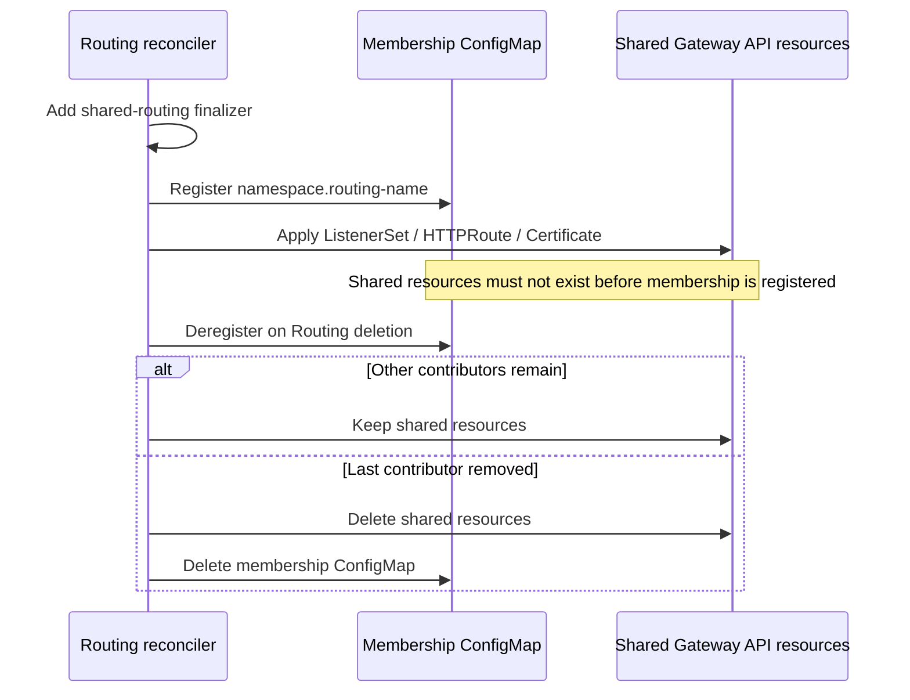

# Gateway API migration flow

`gwapi` owns the routing migration state machine. Reconcilers call
`EvaluateRoutingState` before resource generation. The result decides whether
legacy Istio resources stay in the desired resource set while Gateway API
resources are generated.

```mermaid
stateDiagram-v2
    [*] --> LegacyOnly: routingProvider != standard

    [*] --> StandardOnly: standard ready + no legacy resources
    [*] --> CutoverReadyPruneLegacy: standard ready + legacy resources exist
    [*] --> GreenfieldPending: standard not ready + no legacy resources
    [*] --> MigratingWithFallback: standard not ready + legacy resources exist

    LegacyOnly: Generate legacy routing
    LegacyOnly: Ready=True

    GreenfieldPending: Generate Gateway API only
    GreenfieldPending: Ready=False
    GreenfieldPending: No migration event

    MigratingWithFallback: Generate Gateway API + legacy fallback
    MigratingWithFallback: Set MigrationStartedAt
    MigratingWithFallback: Emit GatewayAPIMigrationStarted

    MigratingWithFallback --> MigrationStalled: MigrationStartedAt older than 10m
    MigrationStalled: Keep legacy fallback
    MigrationStalled: Ready=False
    MigrationStalled: Emit GatewayAPIMigrationStalled once

    MigratingWithFallback --> CutoverReadyPruneLegacy: standard becomes ready
    MigrationStalled --> CutoverReadyPruneLegacy: standard becomes ready

    CutoverReadyPruneLegacy: Stop generating legacy routing
    CutoverReadyPruneLegacy: Prune legacy resources
    CutoverReadyPruneLegacy: Clear MigrationStartedAt
    CutoverReadyPruneLegacy: Emit GatewayAPIMigrationFinished

    CutoverReadyPruneLegacy --> StandardOnly: next reconcile + legacy resources gone

    StandardOnly: Generate Gateway API only
    StandardOnly: Ready=True
```

Legend:

- `standard ready` means ListenerSets, HTTPRoutes, Certificates, and TLS Secrets
  are accepted, programmed, and ready.
- `legacy resources exist` means previous Istio Gateway or VirtualService
  resources are still present.
- Greenfield standard routing never creates legacy fallback.

The state names above are documentation. In code, `RoutingStateResult` carries
what reconcilers act on: `GenerateLegacyRouting`, `Readiness`, and whether the
migration has stalled.

## Shared routing membership

Shared `Routing` objects can come from many namespaces, but the shared Gateway
API resources for their hostname are single objects in `istio-gateways`.
Kubernetes owner references only work cleanly when one owner controls one set of
resources; they cannot model "delete this shared resource only after the last
Routing in any namespace is gone". Skiperator therefore tracks contributors in
one membership `ConfigMap` per hostname.

```mermaid
sequenceDiagram
    participant R as Routing reconciler
    participant CM as Membership ConfigMap
    participant GW as Shared Gateway API resources

    R->>R: Add shared-routing finalizer
    R->>CM: Register namespace.routing-name
    R->>GW: Apply ListenerSet / HTTPRoute / Certificate

    Note over CM,GW: Shared resources must not exist before membership is registered

    R->>CM: Deregister on Routing deletion
    alt Other contributors remain
        R->>GW: Keep shared resources
    else Last contributor removed
        R->>GW: Delete shared resources
        R->>CM: Delete membership ConfigMap
    end
```
